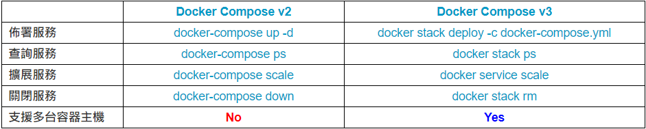

## replicas 

要使用replicas先決條件

 - container_name 不可以定義
 - port 不衝突

佈署方式

```shell
docke stack deploy -c dcoker-compose.yml [ServiceName]

docke stack deploy -c dcoker-compose-v2.yml [ServiceName]

```


```shell
docker swarm init --advertise-addr 192.168.0.8

docker swarm join-token manager

docker swarm join-token worker
```


```shell
docker node ls
```
